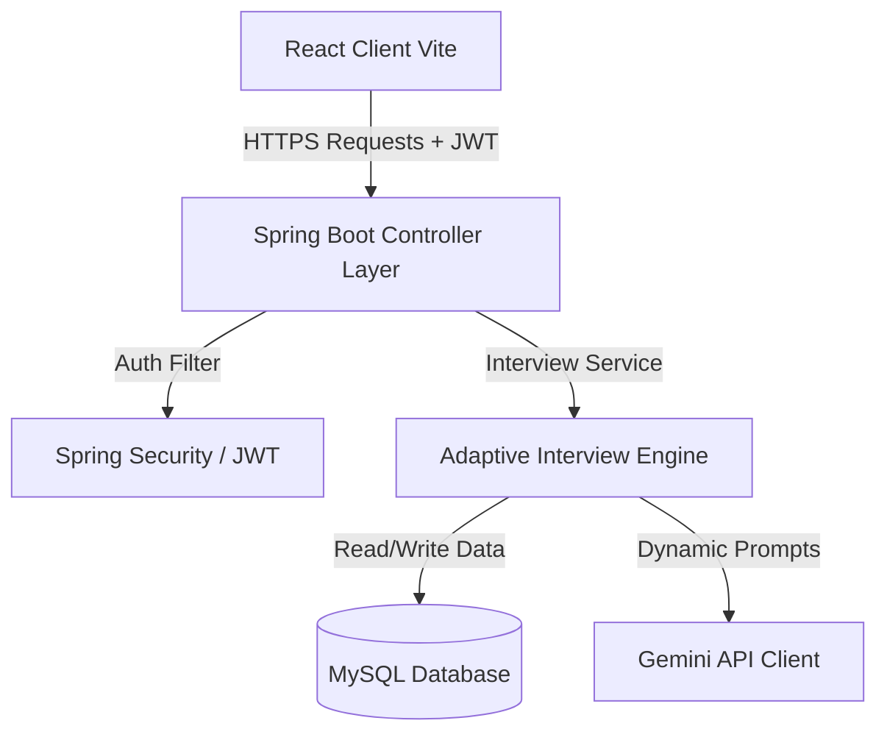

# 🤖 AI Interview Platform (Ai_Interview_Pro)

Welcome to the **AI Interview Platform** (Ai_Interview_Pro), an adaptive, conversational interviewing system that simulates real-life technical interviews. Powered by **Spring Boot**, **React (Vite)**, and **Google Gemini AI**, the application adjusts its questioning strategy dynamically in response to candidate answers, provides automated evaluation feedback, and displays a comprehensive visual dashboard of the candidate's performance.

---

## 📸 Screenshots

> *Below are placeholders for the interface. Add your screenshots here to showcase your beautiful UI.*

| **Dashboard Analytics** | **AI Interview Session** |
| :---: | :---: |


|  |  |

---

## 🌟 Key Features

1. **Adaptive Difficulty Engine**
   - Analyzes user responses in real-time.
   - Automatically pivots question complexity: asks deeper dive questions for strong answers, and clarification or simpler questions for weaker ones.
2. **Topic Distribution & Rotation**
   - Mimics a human interviewer by rotating naturally through core skill categories (e.g., Java, Spring Boot, React, DBMS, System Design).
   - Limits follow-up questioning to a maximum depth of 2 per concept to keep the interview well-rounded.
3. **Conversational Memory & Context Awareness**
   - Uses session state memory to track previously asked questions and user answers, preventing repetition and keeping the dialogue coherent.
4. **Interactive AI Interviewer UI**
   - Features animated interviewer visual state responses, support for speech-to-text response collection, and automatic audio voice synthesis.
5. **AI Analytics Dashboard**
   - Breaks down candidate competencies, tracks score progression, identifies technical weaknesses, and suggests improvement paths.

---

## 🛠️ Tech Stack

- **Frontend**: React (Vite), Tailwind CSS (for styling and modern design), Web Speech API (for voice features).
- **Backend**: Java 17, Spring Boot 3.4.x, Spring Data JPA, Spring Security (JWT).
- **Database**: MySQL.
- **AI Core**: Google Gemini AI Pro / Flash API (via direct Spring HttpClient connection).

---

## 🏗️ Architecture Overview

The platform uses a decoupled client-server architecture:



- **Client**: Handles voice synthesis, audio capture, resume uploading, and candidate interactions.
- **Server**: Manages database schemas, parses user resumes, maintains session flow context, and connects to the Gemini API.
- **Startup Protection**: Uses `StartupValidationConfig` to inspect environment settings on application load, crash-preventing wrong key setups, and executing offline fallbacks gracefully if the Gemini API key is missing.

---

## ⚙️ Environment Configuration

### Backend variables

Define the following environment variables on your system:

| Variable | Description | Mandatory | Fallback / Default |
| :--- | :--- | :---: | :--- |
| `JWT_SECRET` | Base64-encoded secret key of at least 256 bits (32 bytes) for JWT signatures. | **Yes** | *App will crash on startup if missing* |
| `DB_USERNAME` | MySQL database username. | No | `root` |
| `DB_PASSWORD` | MySQL database password. | No | *(Empty)* |
| `DB_URL` | MySQL database connection URL. | No | `jdbc:mysql://localhost:3306/ai_interview_db?createDatabaseIfNotExist=true&serverTimezone=UTC&useSSL=false&allowPublicKeyRetrieval=true` |
| `GEMINI_API_KEY` | Google Gemini API key. | No | *(Warns and disables AI features without crashing)* |

### Frontend variables
Located in a `.env` file in the root directory:
```properties
VITE_API_URL=http://localhost:8080/api
```

---

## 🚀 Installation & Setup

### Prerequisites
- JDK 17 or higher
- Node.js (v18+) & npm
- MySQL (v8+)

### Step 1: Clone the Repository
```bash
git clone https://github.com/vamshikrishnakusuru/Ai_Interview_Pro.git
cd Ai_Interview_Pro
```

### Step 2: Configure and Run Backend
1. Go to the backend folder:
   ```bash
   cd backend
   ```
2. Copy the example properties file:
   ```bash
   cp src/main/resources/application-example.properties src/main/resources/application.properties
   ```
3. Set your environment variables:
   - **PowerShell**:
     ```powershell
     $env:JWT_SECRET="U2VjcmV0S2V5VG9HZW5KV1RzRm9yQUlJbnRlcnZpZXdQcmFjdGljZUFwcDIwMjZNb2Rlcm5Qcm9mZXNzaW9uYWxTdGFjaw=="
     $env:DB_PASSWORD="your_mysql_password"
     $env:GEMINI_API_KEY="your_gemini_api_key_here"
     ```
   - **CMD**:
     ```cmd
     set JWT_SECRET=U2VjcmV0S2V5VG9HZW5KV1RzRm9yQUlJbnRlcnZpZXdQcmFjdGljZUFwcDIwMjZNb2Rlcm5Qcm9mZXNzaW9uYWxTdGFjaw==
     set DB_PASSWORD=your_mysql_password
     set GEMINI_API_KEY=your_gemini_api_key_here
     ```
4. Run the project:
   ```bash
   mvn spring-boot:run
   ```

### Step 3: Configure and Run Frontend
1. Go to the root folder of the project:
   ```bash
   cd ..
   ```
2. Copy the example environment file:
   ```bash
   cp .env.example .env
   ```
3. Install dependencies and start the dev server:
   ```bash
   npm install
   npm run dev
   ```
4. Open your browser to `http://localhost:5173`.

---

## 🗺️ Future Roadmap

- [ ] Add support for video/facial emotion expression analysis using Gemini Multimodal APIs.
- [ ] Implement multi-tenant authentication and user accounts.
- [ ] Support custom corporate question templates and user resume databases.
- [ ] Add collaborative live code evaluation sandboxes (IDE emulation).
- [ ] Generate downloadable PDF candidate feedback reports.
